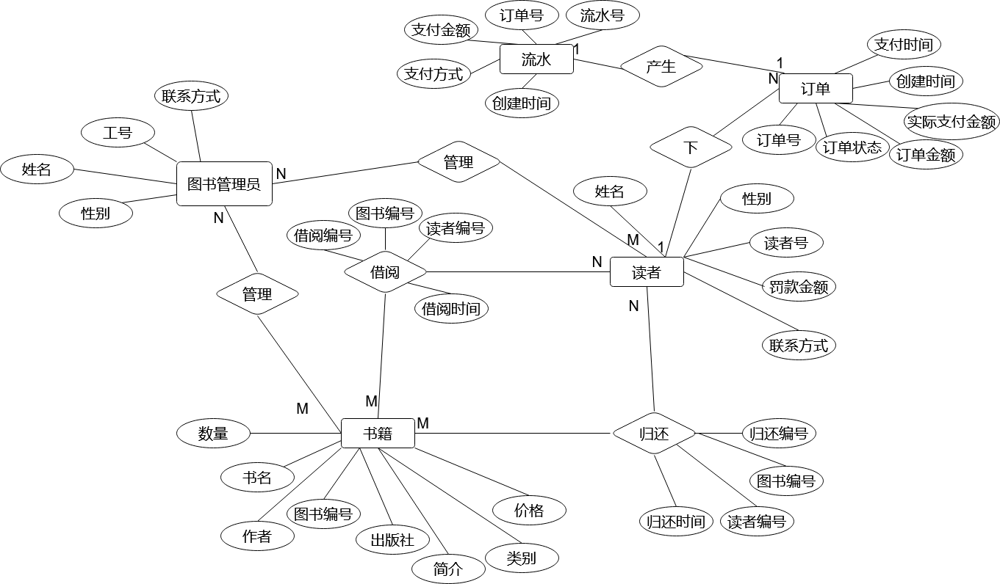
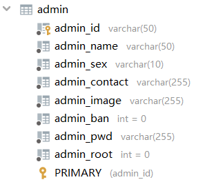
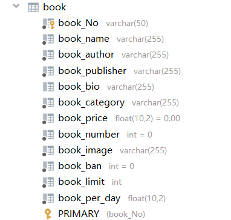
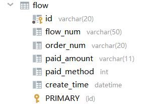
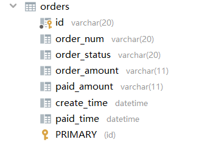
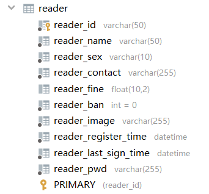
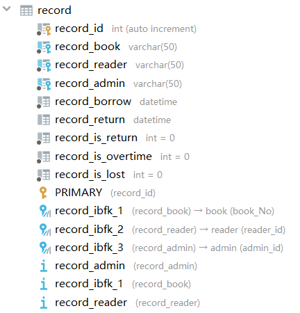
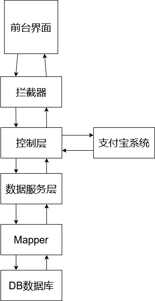
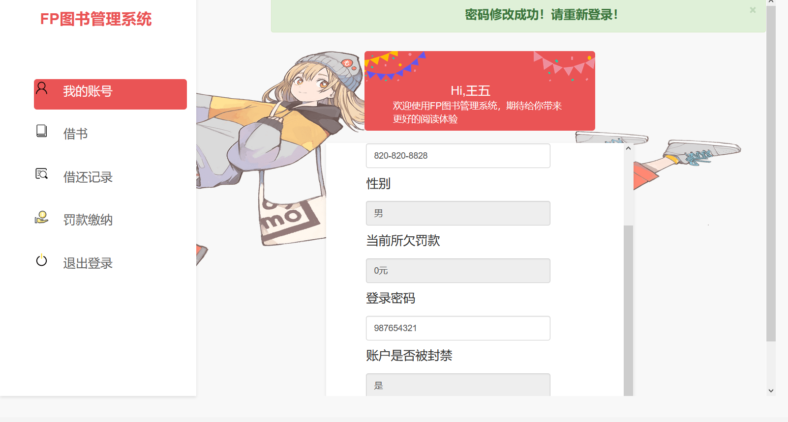

# bms 图书管理系统

## 写在开始
&nbsp;&nbsp;&nbsp;&nbsp;&nbsp;&nbsp;&nbsp;如要使用支付接口，请把[AlipayConfig.java](src/main/java/com/ncu/bms/util/AlipayConfig.java)里的app_id、商户私钥和支付宝公钥换成你自己的，同步通知地址和异步通知地址也请更换为你自己的。本项目的app_id、商户私钥和支付宝公钥将会被重置。

## 项目背景
&nbsp;&nbsp;&nbsp;&nbsp;&nbsp;&nbsp;&nbsp;本项目写于大三下学期暑期专业实训，本来是为了应付小学期而写，但是在写的过程中又有自己的一些想法，所以也不算一次单纯的作业了。  
&nbsp;&nbsp;&nbsp;&nbsp;&nbsp;&nbsp;&nbsp;由于这是本人第一次从项目设计开始到框架搭建再到代码实现，所以这也挺有纪念意义。项目中还融入了调用支付宝接口的部分代码。  
&nbsp;&nbsp;&nbsp;&nbsp;&nbsp;&nbsp;&nbsp;总的来说，通过这次项目，我感觉我心挺大的，想搞很多花里胡哨的东西，但是又无奈于能力不足。不过，我还在学习过程中吧，应该还是挺有进步的。毕竟当初Web大作业的我看到分页是有多么恐慌，当初的我Ajax都不会，这我还是清楚的。

## 项目架构
&nbsp;&nbsp;&nbsp;&nbsp;&nbsp;&nbsp;&nbsp;本项目基于**SSM(Spring+SpringMVC+Mybatis)** 框架集，再整合了**Mybatis Generator**逆向生成工具、**PageHelper**分页工具、**FreeMaker**视图解析器、**JWTToken**验证和**支付宝SDK**。前端使用**bootstrap css**和**jQuery**。通过Ajax实现了前后端分离。

## 参考资料
[1] [支付宝文档](https://opendocs.alipay.com/open/203/105285/)  
[2] [PageHelper使用](https://github.com/pagehelper/Mybatis-PageHelper/blob/master/wikis/zh/HowToUse.md)  
[3] [SSM搭建_1](https://my.oschina.net/u/3085190/blog/1584788)  
[4] [SSM搭建_2](https://www.cnblogs.com/xiaoxiaoyu0707/p/9897481.html)  
[5] [Mybatis Generator配置](https://blog.csdn.net/realxuxin/article/details/103950610/)  
[6] [JWTToke_1](https://www.cnblogs.com/dzcici/p/11670952.html)  
[7] [JWTTolen_2](https://juejin.im/entry/593522150ce463005728585a)  
[8] [调用支付宝接口案例](https://github.com/OUYANGSIHAI/sihai-maven-ssm-alipay)  
[9] [Bootstrap CSS](https://v3.bootcss.com/css/)  

## 图片资源
&nbsp;&nbsp;&nbsp;&nbsp;&nbsp;&nbsp;&nbsp;背景图片来自于一些网站，是我用F12扣出来的。至于一些图标样式，感谢[IconFont](https://www.iconfont.cn/)提供的免费下载。如果背景图片有侵权，请画师及时联系邮箱:fadepi666@gmail.com。

## 项目基本功能

## 数据库设计

#### ER图

***

#### 表

###### admin表

###### book表

###### flow表

###### orders表

###### reader表

###### record表

***

#### 一些说明
&nbsp;&nbsp;&nbsp;&nbsp;&nbsp;&nbsp;&nbsp;其中orders和flow表是用于调用支付宝接口的，注意orders表要么叫orders，要么叫其它名字，不能叫order，因为order是数据库关键字，使用order会报错的。

## 设计思路

## 系统运行结果

## 未修复bug
[1] 支付宝中文验签失败  
[2] JWT超时异常抛出  
...

## 联系方式
邮箱：fadepi666@gmail.com

## 写在最后
技术不是特别强，写得也不是特别好，请多包涵！
